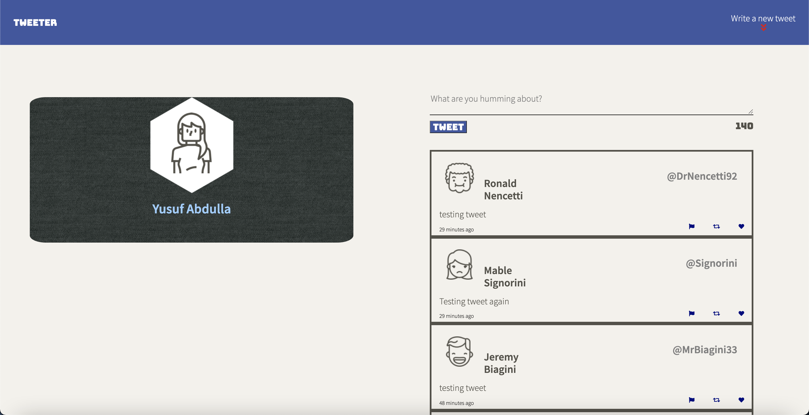
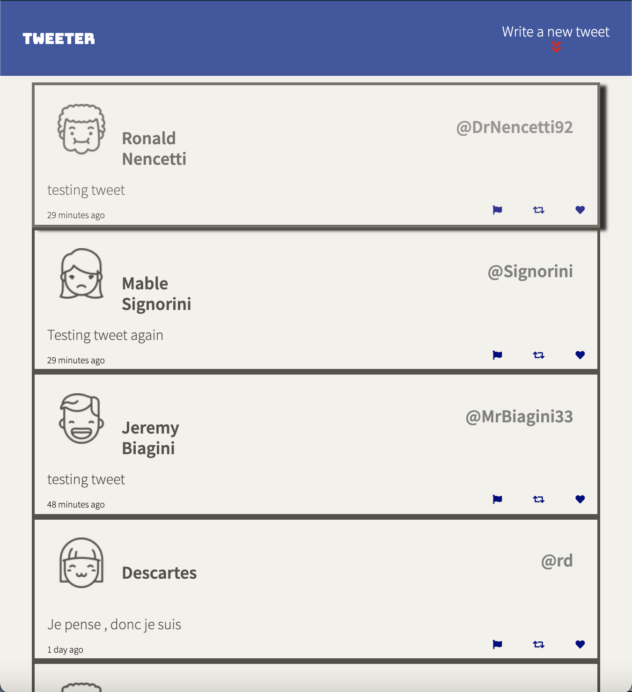
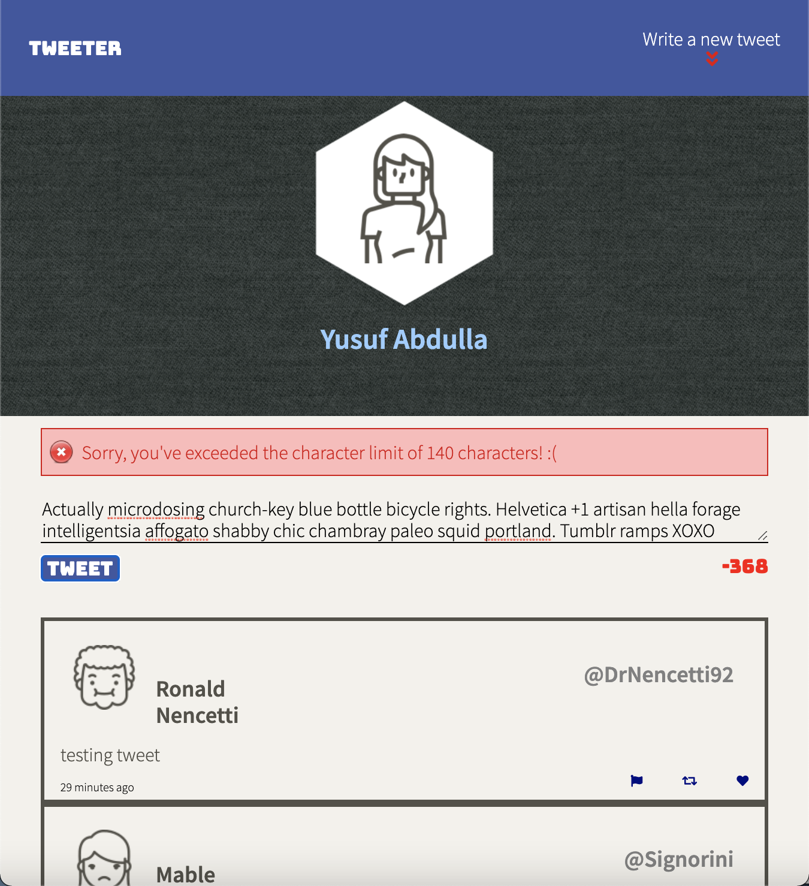

# Tweeter Project

Tweeter is a simple, single-page Twitter clone that provides a responsive design.

The following were the tools that were used to build Tweeter:

- Front-end: HTML, CSS, JS, jQuery and AJAX

- Back-end: Node, Express, MongoDB

Whether you are using a small device or a device with a larger screen, tweeter provides a responsive design that can adapt!

## Final Product

## Getting Started

1. Fork this repository, then clone your fork of this repository.
2. Install dependencies using the `npm install` command.
3. Start the web server using the `npm run local` command. The app will be served at <http://localhost:8080/>.
4. Go to <http://localhost:8080/> in your browser.

## How It Works

### Composing Tweet
- Create a tweet by typing in the textbox below the header. 
- There is a character limit of 140 characters (sadly), but there is a character counter that lets you know how many characters you have left. 
- When you're done, hit the "Tweet" button and your tweet is posted! 
- Once your tweet is posted, the page automatically refreshes and posts the tweet below without having the user manually refresh the page or view the tweet on another page.
 
- If you go over the limit or have not entered any characters in the textbox and hit the "Tweet" button, you'll get an error message!

### List Of Posted Tweets
- Write below the area where you compose your tweet, there is a list of posted tweets that you might've posted or were already in the database. 

- The posted tweets let you know how much time has passed since the tweet was posted 

- When you hover over the tweet, a box-shadow appears around the tweet, and when you hover over the retweet, like or flag icons they change colors! 

### Navigation Bar

- The navigation bar is fixed. Whether you are at the top of the page or scrolling to the bottom, the navigation bar stays in the same position.

- The navigation bar has the Tweeter Icon and a title that instructs the user to write a new tweet below.

### Header
- Depending on the size of the screen, the header changes in size and position. The header contains the users profile image and their name as well as a background design.

## Dependencies

- Express
- Node 5.10.x or above
- Body Parser
- Chance
- MD5
- TimeAgo
